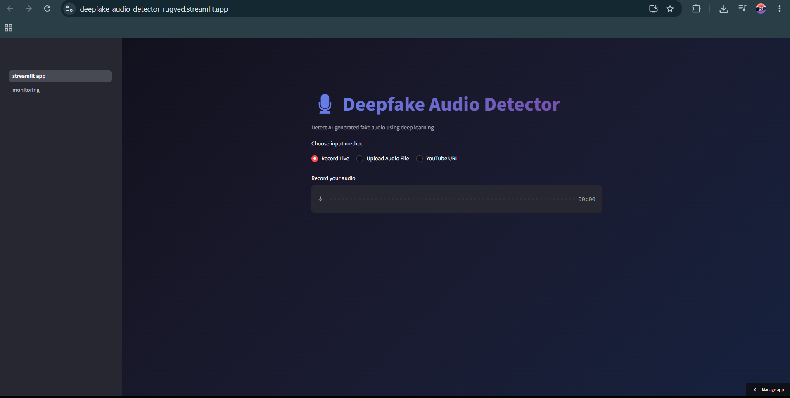
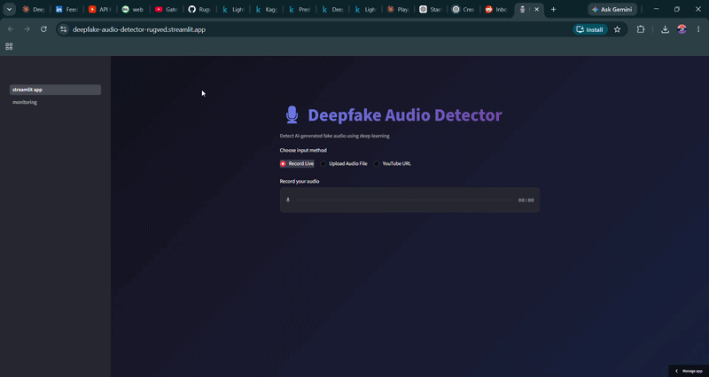
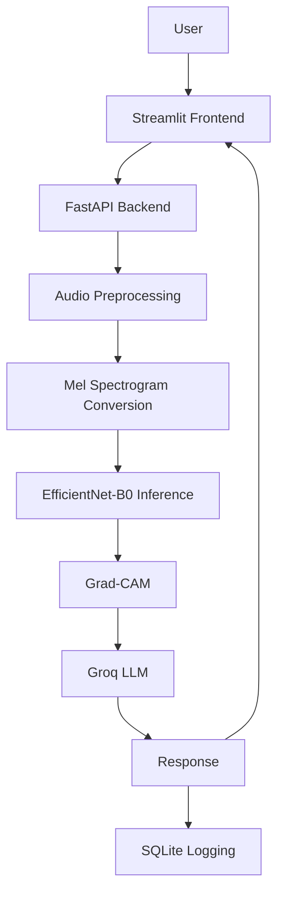

# Deepfake Audio Detector

An end to end deepfake audio detection system built with EfficientNet-B0, FastAPI, and Streamlit with Grad-CAM heatmaps and plain English explanations powered by Groq LLM.



## Demo



## Features

- Upload an audio file or record live audio directly from the browser
- Detects whether audio is real or AI-generated with a confidence score
- Grad-CAM heatmap on the mel spectrogram showing what the model focused on
- Plain English explanation of the prediction generated by Groq LLM
- Monitoring dashboard with real-time prediction analytics (password protected)
- Inference latency optimized from 263 seconds to ~6 seconds on Railway's shared CPU by tuning PyTorch thread settings

## Tech Stack

| Layer | Tools |
|---|---|
| Model | PyTorch, EfficientNet-B0, Scikit-learn |
| Backend | FastAPI, Uvicorn |
| Frontend | Streamlit |
| Explainability | Grad-CAM, Groq LLM |
| Database | SQLite |
| Deployment | Railway, Streamlit Cloud |

## Architecture



**Components:**

- **Streamlit Frontend:** handles user input via file upload or live recording and displays prediction, Grad-CAM heatmap, and LLM explanation
- **FastAPI Backend:** receives audio, runs the full pipeline, and returns results
- **Audio Preprocessing:** converts raw audio to a fixed size array at 16kHz sampling rate
- **Mel Spectrogram Conversion:** converts audio array to a 128x224 mel spectrogram image
- **EfficientNet-B0 Inference:** classifies the spectrogram as real or fake with a confidence score
- **Grad-CAM:** generates a heatmap highlighting which frequency regions influenced the prediction
- **Groq LLM:** takes the prediction, confidence, and heatmap analysis to generate a plain English explanation
- **SQLite Logging:** logs each prediction with timestamp, confidence, latency, and input method

## Model Details

**Architecture**
- EfficientNet-B0 pretrained on ImageNet
- First Conv2d layer modified from 3 channels to 1 channel for mel spectrogram input
- Classifier head replaced with a single output neuron for binary classification
- All layers trainable (full fine-tuning), overfitting handled via weight decay, small learning rate, and early stopping
- Total trainable parameters: 3,989,739

**Training**
- Dataset: ASVspoof 2019 LA (HuggingFace streaming)
- Training samples: 20,304 (2,047 real / 18,257 fake)
- Loss: BCEWithLogitsLoss with pos_weight=2.0 to handle class imbalance (actual ratio ~8.9:1, 2.0 gave best empirical results)
- Optimizer: Adam, lr=5e-5, weight_decay=1e-4
- Gradient clipping: max_norm=1.0
- Max epochs: 20 with early stopping (patience=3)
- Trained for 8 epochs, best weights restored from epoch 5
- Seed fixed at 42 for full reproducibility
- Decision threshold: 0.3

**Validation Accuracy**

Validation accuracy reaches ~100% during training. This is expected and not data leakage. The validation set is a random 20% split of the training data which contains the same attack types (A01-A06) as training. The model memorizes these known attack patterns perfectly. Generalization is measured on the test set which contains entirely unseen attack types (A07-A19).

**Metrics — Full Test Set (71,237 samples, unbalanced real-world distribution)**

| Metric | Score |
|---|---|
| Accuracy | 0.8418 |
| F1 | 0.9033 |
| Precision | 0.9995 |
| Recall | 0.8240 |
| EER | 0.0823 (8.23%) |

The EER of 8.23% is competitive with the official ASVspoof 2019 LA baselines published by the dataset authors (LFCC-GMM: ~8-9% EER).

**Confusion Matrix**

```
                Predicted Real    Predicted Fake
Actual Real          7328               27
Actual Fake         11528            52354
```

- 7,355 real samples — only 27 misclassified (false positives)
- 63,882 fake samples — 11,528 missed (false negatives)

**Why recall is not 100%**

The training set contains attack types A01-A06 only. The test set contains entirely unseen attack types A07-A19 which the model never saw during training. The 17.6% miss rate on fake samples comes from these novel spoofing techniques, not from model miscalibration.

## How to Run Locally

```bash
# clone the repo
git clone https://github.com/RugvedBane/deepfake-audio-detector
cd deepfake-audio-detector

# install dependencies
pip install -r requirements.txt

# set environment variable
export GROQ_API_KEY=your_groq_api_key
```

```bash
# run FastAPI backend
uvicorn app.main:app --reload
```

```bash
# run Streamlit frontend
streamlit run app/streamlit_app.py
```

Then open `http://localhost:8501` in your browser.

## Known Limitations

- Recall is 0.824 due to unseen attack types (A07-A19) in the test set that were never present during training
- SQLite database resets on every Railway redeploy so monitoring data is not persistent
- YouTube URL input is disabled on the hosted version because Railway server IPs are blocked by YouTube's bot detection

## Future Improvements

- Train on WaveFake dataset to cover modern neural vocoders (HiFi-GAN, MelGAN, WaveGlow) and improve generalization to real-world AI-generated voices
- Replace SQLite with PostgreSQL for persistent monitoring data
- Add CNN+LSTM model as a comparison baseline against EfficientNet-B0
