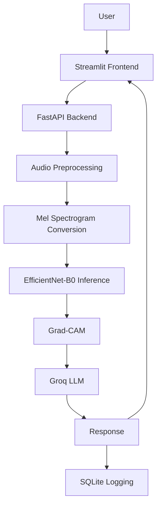

# Deepfake Audio Detector

An end to end deepfake audio detection system built with EfficientNet-B0, FastAPI, and Streamlit with Grad-CAM heatmaps and plain English explanations powered by Groq LLM.


## Demo


## Features

- Upload an audio file or record live audio directly from the browser
- Detects whether audio is real or AI-generated with a confidence score
- Grad-CAM heatmap on the mel spectrogram showing what the model focused on
- Plain English explanation of the prediction generated by Groq LLM
- Monitoring dashboard with real-time prediction analytics (password protected)
- Inference latency optimized from 263 seconds to ~6 seconds on Railway's shared CPU by tuning PyTorch thread settings

## Tech Stack

| Layer | Tools |
|---|---|
| Model | PyTorch, EfficientNet-B0, Scikit-learn |
| Backend | FastAPI, Uvicorn |
| Frontend | Streamlit |
| Explainability | Grad-CAM, Groq LLM |
| Database | SQLite |
| Deployment | Railway, Streamlit Cloud |

## Architecture



**Components:**

- **Streamlit Frontend:** handles user input via file upload or live recording and displays prediction, Grad-CAM heatmap, and LLM explanation
- **FastAPI Backend:** receives audio, runs the full pipeline, and returns results
- **Audio Preprocessing:** converts raw audio to a fixed size array at 16kHz sampling rate
- **Mel Spectrogram Conversion:** converts audio array to a 128x224 mel spectrogram image
- **EfficientNet-B0 Inference:** classifies the spectrogram as real or fake with a confidence score
- **Grad-CAM:** generates a heatmap highlighting which frequency regions influenced the prediction
- **Groq LLM:** takes the prediction, confidence, and heatmap analysis to generate a plain English explanation
- **SQLite Logging:** logs each prediction with timestamp, confidence, latency, and input method

## Model Details

**Architecture**
- EfficientNet-B0 pretrained on ImageNet
- First Conv2d layer modified from 3 channels to 1 channel for mel spectrogram input
- Classifier head replaced with a single output neuron for binary classification
- All layers trained, no layer freezing

**Training**
- Dataset: ASVspoof 2019 LA (HuggingFace streaming)
- Training samples: 25k
- Loss: BCEWithLogitsLoss with pos_weight=2.0 to handle class imbalance
- Optimizer: Adam, lr=0.001
- Epochs: 20 with early stopping
- Decision threshold: 0.4

**Metrics**
| Metric | Score |
|---|---|
| F1 | 0.88 |
| Precision | 0.99 |
| Recall | 0.79 |

**Why recall is low**

ASVspoof 2019 LA training set contains attack types A01-A06 only. The evaluation set contains unseen attack types A07-A19 which the model never saw during training. Threshold tuning did not help because the model outputs near-zero confidence for these unseen attack types, meaning it is a data problem not a calibration problem.

## How to Run Locally

```bash
# clone the repo
git clone https://github.com/RugvedBane/deepfake-audio-detector
cd deepfake-audio-detector

# install dependencies
pip install -r requirements.txt

# set environment variable
export GROQ_API_KEY=your_groq_api_key
```

```bash
# run FastAPI backend
uvicorn app.main:app --reload
```

```bash
# run Streamlit frontend
streamlit run app/streamlit_app.py
```

Then open `http://localhost:8501` in your browser.

## Known Limitations

- Recall is 0.79 due to unseen attack types in the evaluation set that were never present during training
- SQLite database resets on every Railway redeploy so monitoring data is not persistent
- YouTube URL input is disabled on the hosted version because Railway server IPs are blocked by YouTube's bot detection

## Future Improvements

- Retrain on ASVspoof 2021 LA to cover unseen attack types and improve recall
- Train on more diverse real world datasets to improve generalization in noisy environments
- Replace SQLite with PostgreSQL for persistent monitoring data
